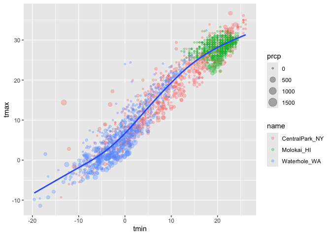
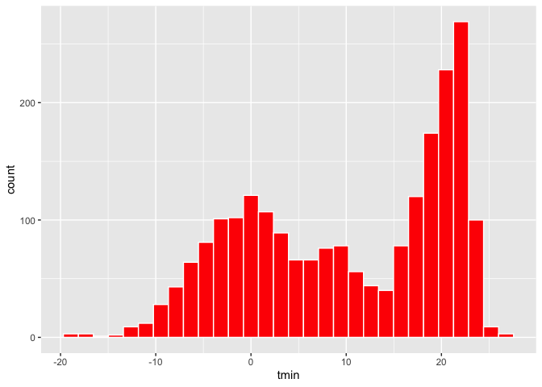

Viz + Eda P1 - Visualization with ggplot2
================
September 25, 2025

``` r
library(tidyverse)
```

    ## ── Attaching core tidyverse packages ──────────────────────── tidyverse 2.0.0 ──
    ## ✔ dplyr     1.1.4     ✔ readr     2.1.5
    ## ✔ forcats   1.0.0     ✔ stringr   1.5.2
    ## ✔ ggplot2   3.5.2     ✔ tibble    3.3.0
    ## ✔ lubridate 1.9.4     ✔ tidyr     1.3.1
    ## ✔ purrr     1.1.0     
    ## ── Conflicts ────────────────────────────────────────── tidyverse_conflicts() ──
    ## ✖ dplyr::filter() masks stats::filter()
    ## ✖ dplyr::lag()    masks stats::lag()
    ## ℹ Use the conflicted package (<http://conflicted.r-lib.org/>) to force all conflicts to become errors

``` r
library(ggridges)
library(p8105.datasets)
```

Let’s important the weather data

``` r
data("weather_df")
```

We’re gonna to make scatterplots.

``` r
ggplot(data = weather_df, mapping = aes(x = tmin, y = tmax)) +
  geom_point()
```

    ## Warning: Removed 17 rows containing missing values or values outside the scale range
    ## (`geom_point()`).

<!-- -->

We can also pipe in the ggplot to pass in the data

``` r
weather_df |> 
  ggplot(aes(x = tmin, y = tmax)) +
  geom_point()
```

    ## Warning: Removed 17 rows containing missing values or values outside the scale range
    ## (`geom_point()`).

<!-- -->

We can save the oplot to a variable

``` r
weather_ggplot =
  weather_df |> 
  ggplot(aes(x = tmin, y = tmax)) +
  geom_point()

weather_ggplot
```

    ## Warning: Removed 17 rows containing missing values or values outside the scale range
    ## (`geom_point()`).

<!-- -->

Some rows are missing. R will give you a warning message. We can filter
to investigate further

``` r
weather_df |> 
  filter(is.na(tmax))
```

    ## # A tibble: 17 × 6
    ##    name         id          date        prcp  tmax  tmin
    ##    <chr>        <chr>       <date>     <dbl> <dbl> <dbl>
    ##  1 Molokai_HI   USW00022534 2022-05-31    NA    NA    NA
    ##  2 Waterhole_WA USS0023B17S 2021-03-09    NA    NA    NA
    ##  3 Waterhole_WA USS0023B17S 2021-12-07    51    NA    NA
    ##  4 Waterhole_WA USS0023B17S 2021-12-31     0    NA    NA
    ##  5 Waterhole_WA USS0023B17S 2022-02-03     0    NA    NA
    ##  6 Waterhole_WA USS0023B17S 2022-08-09    NA    NA    NA
    ##  7 Waterhole_WA USS0023B17S 2022-08-10    NA    NA    NA
    ##  8 Waterhole_WA USS0023B17S 2022-08-11    NA    NA    NA
    ##  9 Waterhole_WA USS0023B17S 2022-08-12    NA    NA    NA
    ## 10 Waterhole_WA USS0023B17S 2022-08-13    NA    NA    NA
    ## 11 Waterhole_WA USS0023B17S 2022-08-14    NA    NA    NA
    ## 12 Waterhole_WA USS0023B17S 2022-08-15    NA    NA    NA
    ## 13 Waterhole_WA USS0023B17S 2022-08-16    NA    NA    NA
    ## 14 Waterhole_WA USS0023B17S 2022-08-17    NA    NA    NA
    ## 15 Waterhole_WA USS0023B17S 2022-08-18    NA    NA    NA
    ## 16 Waterhole_WA USS0023B17S 2022-08-19    NA    NA    NA
    ## 17 Waterhole_WA USS0023B17S 2022-12-31    76    NA    NA

Let’s do some fancy scatterplots. We can change the size, shape of the
points, the colors, etc. Color will give us color for each data name in
the dataset

We use the `alpha` aesthetic to change the density and how opaque the
data is to understand it better.

We can also overlay stats model over the data by using `geom_smooth`, by
plotting standard error lines, but sometimes it’s better to remove it by
using the `se = FALSE`

Remember that the order of operations matter. So by plotting geom_point
first plots the data points first, so by adding another function using
the plus operation to add geom_smooth plots the lines over the data. Had
we plotted geom_smooth before geom_point, it would be hard to see where
the line is.

``` r
weather_df |> 
  ggplot(aes(x = tmin, y = tmax, color = name)) +
  geom_point(alpha = 0.3) +
  geom_smooth(se = FALSE)
```

    ## `geom_smooth()` using method = 'loess' and formula = 'y ~ x'

    ## Warning: Removed 17 rows containing non-finite outside the scale range
    ## (`stat_smooth()`).

    ## Warning: Removed 17 rows containing missing values or values outside the scale range
    ## (`geom_point()`).

<!-- -->

Where you define aeshtetics matters by putting the color in `geom_point`
instead. It plots one line through the data. This shows flexibility in
designing mapping. We can also define the alpha further and size to
change the size of everyt poiint

``` r
weather_df |> 
  ggplot(aes(x = tmin, y = tmax)) +
  geom_point(aes(color = name, size = prcp), alpha = 0.3) +
  geom_smooth(se = FALSE)
```

    ## `geom_smooth()` using method = 'gam' and formula = 'y ~ s(x, bs = "cs")'

    ## Warning: Removed 17 rows containing non-finite outside the scale range
    ## (`stat_smooth()`).

    ## Warning: Removed 19 rows containing missing values or values outside the scale range
    ## (`geom_point()`).

<!-- -->

We can also add more layers to split into multiple plots to see the data
in multiple ways. The current data is too difficult to understand where
the data might or might not be. Take a look below using facets. Using
the dot (means nothing), the symbol ~ (communicates to R differences
between the left and right hand side), and name (separate by name) will
allow us to produce a facet plot showing all datasets or subgroups

``` r
weather_df |> 
  ggplot(aes(x = tmin, y = tmax)) +
  geom_point(aes(color = name), alpha = 0.3, size = 0.8) +
  geom_smooth(se = FALSE) +
  facet_grid(. ~ name)
```

    ## `geom_smooth()` using method = 'loess' and formula = 'y ~ x'

    ## Warning: Removed 17 rows containing non-finite outside the scale range
    ## (`stat_smooth()`).

    ## Warning: Removed 17 rows containing missing values or values outside the scale range
    ## (`geom_point()`).

<!-- -->

Interesting scatterplots. Shape basically basically tells R each column
has a different shape, so we organize it by column/name

``` r
weather_df |> 
  ggplot(aes(x = tmin, y = tmax, color = name, shape = name)) +
  geom_point(aes(size = prcp), alpha = 0.3) +
  geom_smooth(se = FALSE) +
  facet_grid(. ~ name)
```

    ## `geom_smooth()` using method = 'loess' and formula = 'y ~ x'

    ## Warning: Removed 17 rows containing non-finite outside the scale range
    ## (`stat_smooth()`).

    ## Warning: Removed 19 rows containing missing values or values outside the scale range
    ## (`geom_point()`).

<!-- -->

Learning assessment. We filter to narrow it down to CentralPark_NY. When
we create something new, we create mutate. We create the variable names.
We do 9/5 to convert from celsius to fareinght and add 32 for tmix and
tmax variables. Methods can help create linear regression, so we plot
“lm” in it to plot across the data points

``` r
weather_df |> 
  filter(name == "CentralPark_NY") |> 
  mutate(
    tmax_f = tmax * (9/5) + 32,
    tmin_f = tmin * (9/5) + 32) |> 
  ggplot(aes(x = tmin_f, y = tmax_f)) +
  geom_point() +
  geom_smooth(se = FALSE, method = "lm")
```

    ## `geom_smooth()` using formula = 'y ~ x'

<!-- -->

Other plots

``` r
weather_df |> 
  ggplot(aes(x = tmin, y = tmax)) +
  geom_hex()
```

    ## Warning: Removed 17 rows containing non-finite outside the scale range
    ## (`stat_binhex()`).

<!-- -->

We can also map aeshtetics differently. Let’s say someone wants the data
points to be a specific color for all data points, we can do that. We
can either type the color, or find the color code online and type that
instead

``` r
weather_df |> 
  ggplot(aes(x = tmin, y = tmax)) +
  geom_point(color = "green")
```

    ## Warning: Removed 17 rows containing missing values or values outside the scale range
    ## (`geom_point()`).

<!-- -->

We don’t need to set Y for histrograms, since the Y axis will represent
the count in a specific variable, so let’s plot a histogram now. Color
is the outer lines of the mappings and the fill aethetics is the inside
of the plots/mappings. Without specifcing color and fill, the data
points will overlap each other

``` r
weather_df |> 
  ggplot(aes(x = tmin)) +
  geom_histogram(color = "white", fill = "red")
```

    ## `stat_bin()` using `bins = 30`. Pick better value with `binwidth`.

    ## Warning: Removed 17 rows containing non-finite outside the scale range
    ## (`stat_bin()`).

<!-- -->

``` r
weather_df |> 
  ggplot(aes(x = tmin, color = name)) +
  geom_histogram()
```

    ## `stat_bin()` using `bins = 30`. Pick better value with `binwidth`.

    ## Warning: Removed 17 rows containing non-finite outside the scale range
    ## (`stat_bin()`).

<!-- -->

``` r
weather_df |> 
  ggplot(aes(x = tmin, fill = name)) +
  geom_histogram()
```

    ## `stat_bin()` using `bins = 30`. Pick better value with `binwidth`.

    ## Warning: Removed 17 rows containing non-finite outside the scale range
    ## (`stat_bin()`).

<!-- -->

``` r
weather_df |> 
  ggplot(aes(x = tmin, fill = name)) +
  geom_histogram() +
  facet_grid(name ~ .)
```

    ## `stat_bin()` using `bins = 30`. Pick better value with `binwidth`.

    ## Warning: Removed 17 rows containing non-finite outside the scale range
    ## (`stat_bin()`).

<!-- -->

We could also do a density plot and we cna lwoer the alpha to compare
mappings

``` r
weather_df |> 
  ggplot(aes(x = tmin, fill = name)) +
  geom_density(alpha = 0.5)
```

    ## Warning: Removed 17 rows containing non-finite outside the scale range
    ## (`stat_density()`).

<!-- -->

We can also do boxplots and add colors inside of the box

``` r
weather_df |> 
  ggplot(aes(x = name, y = tmin)) +
  geom_boxplot(aes(fill = name))
```

    ## Warning: Removed 17 rows containing non-finite outside the scale range
    ## (`stat_boxplot()`).

<!-- -->

We can also do a violin plot

``` r
weather_df |> 
  ggplot(aes(x = name, y = tmin, fill = name)) +
  geom_violin()
```

    ## Warning: Removed 17 rows containing non-finite outside the scale range
    ## (`stat_ydensity()`).

<!-- -->

Let’s do ridge plots

``` r
weather_df |> 
  ggplot(aes(x = tmin, y = name, fill = name)) +
  geom_density_ridges()
```

    ## Picking joint bandwidth of 1.41

    ## Warning: Removed 17 rows containing non-finite outside the scale range
    ## (`stat_density_ridges()`).

<!-- -->

Learning assessments plotting the prcp variable

``` r
weather_df |> 
  filter(prcp > 5, prcp < 1000) |> 
  ggplot(aes(x = prcp, fill = name)) +
  geom_density(alpha = 0.2)
```

<!-- -->

Let’s now save these plots as objects

``` r
ggp_prcp_plot =
  weather_df |> 
  filter(prcp > 5, prcp < 1000) |> 
  ggplot(aes(x = prcp, fill = name)) +
  geom_density(alpha = 0.2)

ggsave("data/density_prcp_plot.pdf", ggp_prcp_plot, width = 8, height = 6)
```

Embedding plots

``` r
ggp_prcp_plot
```

<!-- -->
