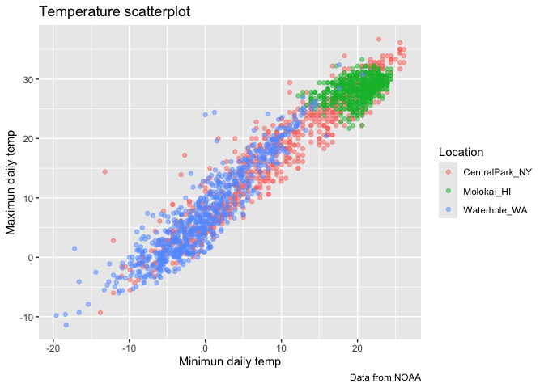

Viz II - Visualization with ggplot2
================
September 30, 2025

``` r
library(tidyverse)
```

    ## ── Attaching core tidyverse packages ──────────────────────── tidyverse 2.0.0 ──
    ## ✔ dplyr     1.1.4     ✔ readr     2.1.5
    ## ✔ forcats   1.0.0     ✔ stringr   1.5.2
    ## ✔ ggplot2   3.5.2     ✔ tibble    3.3.0
    ## ✔ lubridate 1.9.4     ✔ tidyr     1.3.1
    ## ✔ purrr     1.1.0     
    ## ── Conflicts ────────────────────────────────────────── tidyverse_conflicts() ──
    ## ✖ dplyr::filter() masks stats::filter()
    ## ✖ dplyr::lag()    masks stats::lag()
    ## ℹ Use the conflicted package (<http://conflicted.r-lib.org/>) to force all conflicts to become errors

``` r
library(patchwork)
library(p8105.datasets)
```

``` r
data("weather_df")
```

Let’s make a basic scatterplot. We can use xlabs and ylabs to label the
axis.Aadd labels if you’re sending to someone else

``` r
weather_df |> 
  ggplot(aes(x = tmin, y = tmax)) +
  geom_point(aes(color = name), alpha = 0.5) +
  labs(
      x = "Minimun daily temp",
      y = "Maximun daily temp",
      title = "Temperature scatterplot",
      caption = "Data from NOAA",
      color = "Location"
  )
```

    ## Warning: Removed 17 rows containing missing values or values outside the scale range
    ## (`geom_point()`).

<!-- -->

We are able to control the scales in the graphs. Scale x continous
because oru x-axis is contrinuous but can also be categotical. We can
labels and breaks. We can do a square root transformaiton on the y axis.
We can also add limits to zoom in the plots

We can also do filter to place limits rather than using the limits
function. This can be done before typing ggplot. For example,
filter(tmin \> 10, \<tmax 30 ).

We can alos playing around with the color pallete using scale_color_hue,
but don’t do that. Refer to color palletes used from online sources.
Look at the p8105 website for reference. Use the viridis package instead
using the viridis::scale_color_viridi

``` r
weather_df |> 
  ggplot(aes(x = tmin, y = tmax)) +
  geom_point(aes(color = name), alpha = 0.5) +
  labs(
      x = "Minimun daily temp",
      y = "Maximun daily temp",
      title = "Temperature scatterplot",
      caption = "Data from NOAA",
      color = "Location"
  ) +
  scale_x_continuous(
    breaks = c(-20, 0, 25),
    labels = c("-20C", "0", "25")
  ) +
  scale_y_continuous(
    trans = "sqrt",
    limits = c(10, 30)
  ) +
  viridis::scale_color_viridis(
    discrete = TRUE
  )
```

    ## Warning in transformation$transform(x): NaNs produced

    ## Warning in scale_y_continuous(trans = "sqrt", limits = c(10, 30)): sqrt
    ## transformation introduced infinite values.

    ## Warning: Removed 843 rows containing missing values or values outside the scale range
    ## (`geom_point()`).

<!-- -->

Themes help with changing everything in the plot.

We can also use ggsave to save the plot or create a variable to save the
plot in the workspace/environment for manipulation letter

``` r
gg_temperature = weather_df |> 
  ggplot(aes(x = tmin, y = tmax)) +
  geom_point(aes(color = name), alpha = 0.5) +
  labs(
      x = "Minimun daily temp",
      y = "Maximun daily temp",
      title = "Temperature scatterplot",
      caption = "Data from NOAA",
      color = "Location"
  ) +
  scale_x_continuous(
    breaks = c(-20, 0, 25),
    labels = c("-20C", "0", "25")
  ) +
  scale_y_continuous(
    trans = "sqrt",
    limits = c(10, 30)
  ) +
  viridis::scale_color_viridis(
    discrete = TRUE
  )
```

Themes help with changing everything in the plot. You can use
theme_minimal, theme_bw, theme_dark to change the theme of the plot.
legend.posotion moves the legends to the bottom of the X axis.
These_minimal we get white backgrounds with gray lines

``` r
gg_temperature + 
  theme_minimal() +
  theme(legend.position = "bottom")
```

    ## Warning in transformation$transform(x): NaNs produced

    ## Warning in scale_y_continuous(trans = "sqrt", limits = c(10, 30)): sqrt
    ## transformation introduced infinite values.

    ## Warning: Removed 843 rows containing missing values or values outside the scale range
    ## (`geom_point()`).

<!-- -->

Let’s add data in geoms.

``` r
central_park_df =
  weather_df |> 
  filter(name == "CentralPark_NY")

molokai_df =
  weather_df |> 
  filter(name == "Molokai_HI")

ggplot(data = molokai_df, aes(x = date, y = tmax, color = name)) +
  geom_point() +
  geom_line(data = central_park_df)
```

    ## Warning: Removed 1 row containing missing values or values outside the scale range
    ## (`geom_point()`).

<!-- -->
