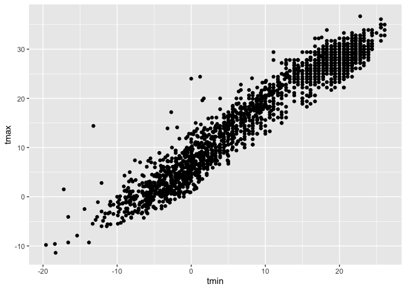
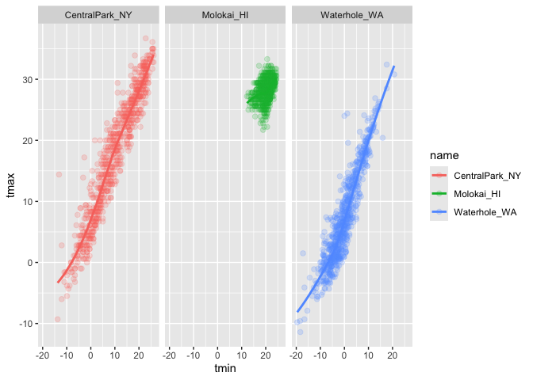
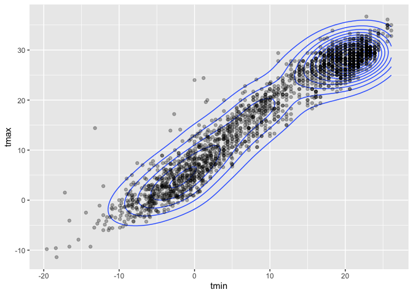
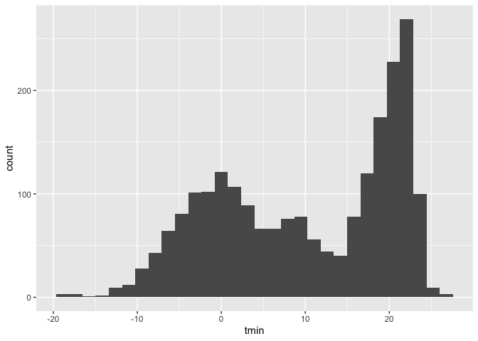
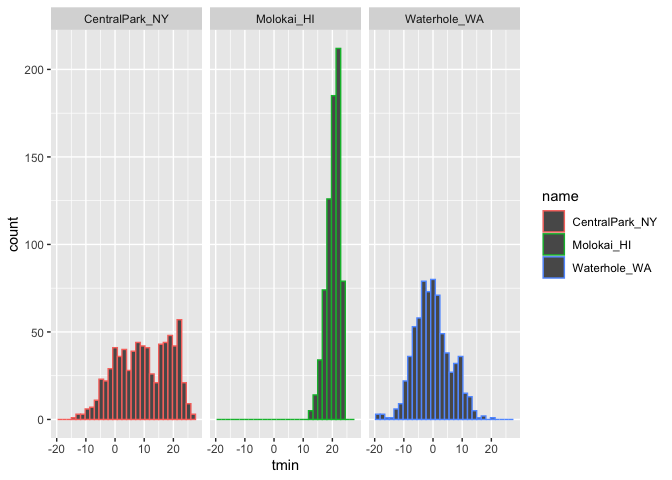
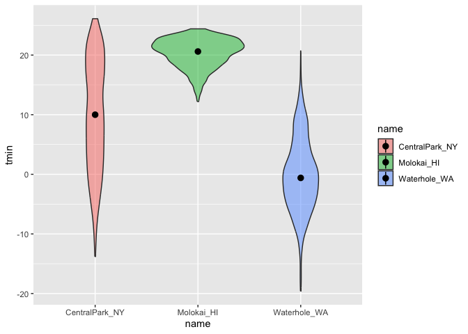

Viz + Eda P1 - Visualization with ggplot2
================
September 25, 2025

``` r
library(tidyverse)
```

    ## ── Attaching core tidyverse packages ──────────────────────── tidyverse 2.0.0 ──
    ## ✔ dplyr     1.1.4     ✔ readr     2.1.5
    ## ✔ forcats   1.0.0     ✔ stringr   1.5.2
    ## ✔ ggplot2   3.5.2     ✔ tibble    3.3.0
    ## ✔ lubridate 1.9.4     ✔ tidyr     1.3.1
    ## ✔ purrr     1.1.0     
    ## ── Conflicts ────────────────────────────────────────── tidyverse_conflicts() ──
    ## ✖ dplyr::filter() masks stats::filter()
    ## ✖ dplyr::lag()    masks stats::lag()
    ## ℹ Use the conflicted package (<http://conflicted.r-lib.org/>) to force all conflicts to become errors

``` r
library(ggridges)
```

``` r
library(p8105.datasets)
data("weather_df")
```

Let’s now do scatterplots

``` r
ggplot(weather_df, aes(x = tmin, y = tmax)) +
  geom_point()
```

    ## Warning: Removed 17 rows containing missing values or values outside the scale range
    ## (`geom_point()`).

<!-- -->

New approach. Same splot. This allows me to mutate and also do data
manipulaiton

``` r
weather_df |> 
  ggplot(aes(x = tmin, y = tmax)) +
  geom_point()
```

    ## Warning: Removed 17 rows containing missing values or values outside the scale range
    ## (`geom_point()`).

<!-- -->

``` r
weather_plot =
  weather_df |> 
  ggplot(aes(x = tmin, y = tmax))

weather_plot + geom_point()
```

    ## Warning: Removed 17 rows containing missing values or values outside the scale range
    ## (`geom_point()`).

<!-- -->

Let’s now do an advanced scatterplot by making it visually useful. SE
for geom_smooth is basically a confidence limit. Geom_smooth gives some
smooth tracjectory through data

``` r
weather_df |> 
  ggplot(aes(x = tmin, y = tmax, color = name)) +
  geom_point() +
  geom_smooth(se = FALSE)
```

    ## `geom_smooth()` using method = 'loess' and formula = 'y ~ x'

    ## Warning: Removed 17 rows containing non-finite outside the scale range
    ## (`stat_smooth()`).

    ## Warning: Removed 17 rows containing missing values or values outside the scale range
    ## (`geom_point()`).

<!-- -->

Aes placement is also important. Aes in geom_point goes through the
specific names of the data. We can add geom_smooth to define one line
through the data

``` r
weather_df |> 
  ggplot(aes(x = tmin, y = tmax)) +
  geom_point(aes(color = name)) +
  geom_smooth(se = FALSE)
```

    ## `geom_smooth()` using method = 'gam' and formula = 'y ~ s(x, bs = "cs")'

    ## Warning: Removed 17 rows containing non-finite outside the scale range
    ## (`stat_smooth()`).

    ## Warning: Removed 17 rows containing missing values or values outside the scale range
    ## (`geom_point()`).

<!-- -->

We can aslo facets plots, graph. Facets –\> number of rows, columns,
etc, basiclaly defines them. Adding the dot and ~ and name defines the
columns and rows, but could also be done reverse by adding name, then ~
and then the dot for facet_grid to change things

We can also define the alpha to change the appearance of data points as
well as change size of the points. Alpha levle could be added to either
functions of ggplot, including geom_point, geom_smooth, depending on the
variable, but could also be a global option

``` r
weather_df |> 
  ggplot(aes(x = tmin, y = tmax, color = name)) +
  geom_point(alpha = .2, size = 2) +
  geom_smooth(se = FALSE) +
  facet_grid(. ~ name)
```

    ## `geom_smooth()` using method = 'loess' and formula = 'y ~ x'

    ## Warning: Removed 17 rows containing non-finite outside the scale range
    ## (`stat_smooth()`).

    ## Warning: Removed 17 rows containing missing values or values outside the scale range
    ## (`geom_point()`).

<!-- -->

Let’s combine some elements and try a new plot. Define our data,
defining aesthetics, and defining elements of the plot. We can change
little things until we’re satisfied with the plot

``` r
weather_df |> 
  ggplot(aes(x = date, y = tmax, color = name)) +
  geom_point(aes(size = prcp), alpha = 0.5) +
  geom_smooth(se = FALSE) + 
  facet_grid(. ~ name)
```

    ## `geom_smooth()` using method = 'loess' and formula = 'y ~ x'

    ## Warning: Removed 17 rows containing non-finite outside the scale range
    ## (`stat_smooth()`).

    ## Warning: Removed 19 rows containing missing values or values outside the scale range
    ## (`geom_point()`).

<!-- -->

Geoms to exist –\> how many? We can have what geoms we want. In the
example below, we don’t include the datapoints but we do include the
lines that go through each data point. Might not be as useful

``` r
weather_df |> 
  ggplot(aes(x = tmin, y = tmax, color = name)) +
  geom_smooth(se = FALSE)
```

    ## `geom_smooth()` using method = 'loess' and formula = 'y ~ x'

    ## Warning: Removed 17 rows containing non-finite outside the scale range
    ## (`stat_smooth()`).

<!-- -->

Neat geoms and other plots

``` r
weather_df |> 
  ggplot(aes(x = tmin, y = tmax)) +
  geom_density2d() +
  geom_point(alpha = .3)
```

    ## Warning: Removed 17 rows containing non-finite outside the scale range
    ## (`stat_density2d()`).

    ## Warning: Removed 17 rows containing missing values or values outside the scale range
    ## (`geom_point()`).

<!-- -->

Univariate plots –\> we talk about one variable at a time. One example
is histograms

``` r
weather_df |> 
  ggplot(aes(x = tmin)) +
  geom_histogram()
```

    ## `stat_bin()` using `bins = 30`. Pick better value with `binwidth`.

    ## Warning: Removed 17 rows containing non-finite outside the scale range
    ## (`stat_bin()`).

<!-- -->

We can also add color to histograms. It basically stacks up color, but
the location of these things are not great and the color outside of
bars. What we can do is have them dodge each other.

``` r
weather_df |> 
  ggplot(aes(x = tmin, color = name)) +
  geom_histogram(position = "dodge")
```

    ## `stat_bin()` using `bins = 30`. Pick better value with `binwidth`.

    ## Warning: Removed 17 rows containing non-finite outside the scale range
    ## (`stat_bin()`).

<!-- -->

We can use facet_drigs to look at them separately. We don’t need to sue
color to look at them differently if you prefer that

``` r
weather_df |> 
  ggplot(aes(x = tmin, color = name)) +
  geom_histogram(position = "dodge") +
  facet_grid(. ~ name)
```

    ## `stat_bin()` using `bins = 30`. Pick better value with `binwidth`.

    ## Warning: Removed 17 rows containing non-finite outside the scale range
    ## (`stat_bin()`).

<!-- -->

New geomatry. By using density, we can smooth out the histogram, but we
lose some information, but makes it easier to compare shapes across
data. We can also add adjust to have more information of single data
points which might be represented as bumps in the graph. Prof. Goldsmith
usually leaves it as default of the alpha without adjusting.

``` r
weather_df |> 
  ggplot(aes(x = tmin, fill = name)) +
  geom_density(alpha = .3, adjust = .5)
```

    ## Warning: Removed 17 rows containing non-finite outside the scale range
    ## (`stat_density()`).

<!-- -->

We can also do box plots. Gives us the 75th/25th percentile, as well as
the mean and informaiton around the whiskers.

``` r
weather_df |> 
  ggplot(aes(x = name, y = tmin)) +
  geom_boxplot()
```

    ## Warning: Removed 17 rows containing non-finite outside the scale range
    ## (`stat_boxplot()`).

<!-- -->

Univariate plots like violin plots. It mirrors positive and negative in
the same direction around the edges. Could be easier to understand. We
can decide what plots is better for my data. We can also use stat
summary to get the media for example. If you don’t specify it, it will
give you the mean

``` r
weather_df |> 
  ggplot(aes(x = name, y = tmin, fill = name)) +
           geom_violin(alpha = .5) +
  stat_summary(fun = median)
```

    ## Warning: Removed 17 rows containing non-finite outside the scale range
    ## (`stat_ydensity()`).

    ## Warning: Removed 17 rows containing non-finite outside the scale range
    ## (`stat_summary()`).

    ## Warning: Removed 3 rows containing missing values or values outside the scale range
    ## (`geom_segment()`).

<!-- -->

Let’s also do ridge plots, which was popular in 2017. We can see the
density curves. It is easier to see. Might be helpful when you have
categorical data with lots of variables.

``` r
weather_df |> 
  ggplot(aes(x = tmin, y = name)) +
  geom_density_ridges()
```

    ## Picking joint bandwidth of 1.41

    ## Warning: Removed 17 rows containing non-finite outside the scale range
    ## (`stat_density_ridges()`).

<!-- -->
